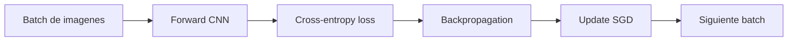

> AlexNet (Krizhevsky, Sutskever, Hinton, 2012) gano ImageNet y mostro que CNN profundas + GPU podian superar claramente metodos previos.

## 1. Contexto historico

- Competencia: ImageNet LSVRC 2012.
- Resultado: gran salto en error top-5 frente al estado del arte.
- Impacto: acelero la adopcion de deep learning en vision por computadora.

## 2. Que problema resolvia

Clasificar imagenes en 1000 clases a gran escala, aprendiendo features directamente desde pixeles.

## 2.1 Diagrama de arquitectura CNN (tipo AlexNet)

```mermaid
flowchart LR
    I[Imagen de entrada] --> C1[Conv + ReLU]
    C1 --> P1[MaxPool]
    P1 --> C2[Conv + ReLU]
    C2 --> P2[MaxPool]
    P2 --> C3[Conv + ReLU]
    C3 --> C4[Conv + ReLU]
    C4 --> C5[Conv + ReLU]
    C5 --> P3[MaxPool]
    P3 --> FC1[Fully Connected + ReLU + Dropout]
    FC1 --> FC2[Fully Connected + ReLU + Dropout]
    FC2 --> FC3[Fully Connected]
    FC3 --> SM[Softmax]
    SM --> Y[Clase predicha]
```

## 3. Bloques de una CNN

### 3.1 Convolucion

$$
Y_{i,j,k} = \sum_{u,v,c} X_{i+u,j+v,c} \cdot W_{u,v,c,k} + b_k
$$

Extrae patrones locales (bordes, texturas, formas).

### 3.2 Activacion (ReLU)

$$
\text{ReLU}(x) = \max(0, x)
$$

Acelera entrenamiento frente a activaciones saturantes.

### 3.3 Pooling

Reduce resolucion espacial y mejora robustez.

### 3.4 Capas fully-connected

Combinan features para producir logits de clase.

### 3.5 Softmax

Convierte logits en probabilidades.

## 4. Aportes clave de AlexNet

- CNN profunda entrenada en GPU.
- Uso fuerte de ReLU.
- Data augmentation (recortes, flips, etc.).
- Dropout en capas fully-connected.

## 5. Flujo de entrenamiento

1. Imagen de entrada.
2. Convoluciones + ReLU + pooling.
3. Capas fully-connected.
4. Softmax + cross-entropy.
5. Backprop + SGD para actualizar pesos.

## 6. Limitaciones

- Muchos parametros en capas fully-connected.
- Alto costo computacional para su epoca.
- Luego fue superada por VGG, Inception, ResNet, etc.

## 7. Legado

- Establecio el pipeline moderno de vision con CNN.
- Mostro el valor de escalar datos + computo + modelos.
- Es un hito clave para entender la evolucion hacia modelos actuales.

## 8. Ejercicios sugeridos

1. Implementar una mini-CNN y entrenarla en CIFAR-10 o MNIST.
2. Probar ReLU vs tanh en la misma arquitectura.
3. Medir efecto de data augmentation en validation accuracy.
