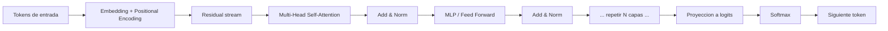

> Basado en el capitulo 8 del libro de referencia (Welch Labs): la atencion es el mecanismo central que permite a un LLM relacionar tokens entre si para predecir el siguiente token.

## 1. Idea central

Un modelo autoregresivo predice el proximo token usando los tokens previos.
La atencion decide **que tokens previos son relevantes** para cada posicion.

## 1.1 Diagrama de un Transformer (bloque)



## 2. Proyecciones Q, K, V

Dado el estado de entrada de una capa $$X$$:

$$
Q = XW_Q, \quad K = XW_K, \quad V = XW_V
$$

Simbolos:
- $$X$$: matriz de entrada de la capa (tokens x dimension del modelo).
- $$Q$$: matriz de *queries*.
- $$K$$: matriz de *keys*.
- $$V$$: matriz de *values*.
- $$W_Q, W_K, W_V$$: matrices de pesos aprendibles.

## 2.1 Diagrama de una cabeza de atencion

```mermaid
flowchart LR
    X[Entrada X] --> Q[Q = X W_Q]
    X --> K[K = X W_K]
    X --> V[V = X W_V]
    Q --> S[Scores S = Q K^T / sqrt(d_k)]
    K --> S
    S --> M[Aplicar mascara causal]
    M --> A[Softmax por fila -> A]
    A --> O[Salida O = A V]
    V --> O
```

## 3. Scores y patron de atencion

$$
S = \frac{QK^T}{\sqrt{d_k}}
$$

Simbolos:
- $$S$$: matriz de *scores* de atencion.
- $$K^T$$: traspuesta de $$K$$.
- $$d_k$$: dimension de cada vector key/query.
- $$\sqrt{d_k}$$: factor de escala para estabilizar softmax.

Con mascara causal y softmax:

$$
A = \mathrm{softmax}(S + M)
$$

Simbolos:
- $$A$$: patron de atencion (filas que suman 1).
- $$M$$: mascara causal (bloquea mirar tokens futuros).
- $$\mathrm{softmax}(\cdot)$$: normalizacion por fila.

## 4. Salida de una cabeza

$$
O = AV
$$

Simbolos:
- $$O$$: salida de la cabeza de atencion.
- $$A$$: pesos de mezcla entre posiciones.
- $$V$$: contenido que se combina segun $$A$$.

Lectura rapida: cada token de salida es una combinacion ponderada de valores de tokens previos.

## 5. Multi-head attention

Cada cabeza aprende relaciones distintas; luego se concatenan:

$$
\mathrm{MHA}(X) = \mathrm{Concat}(O_1,\dots,O_h)W_O
$$

Simbolos:
- $$O_i$$: salida de la cabeza $$i$$.
- $$h$$: cantidad de cabezas.
- $$\mathrm{Concat}(\cdot)$$: concatenacion por dimension de features.
- $$W_O$$: proyeccion final aprendible.

## 6. KV cache (inferencia)

En generacion token a token, se reutilizan keys/values viejos y solo se calcula la nueva query.

Memoria aproximada del cache por secuencia:

$$
\text{Mem}_{KV} \propto 2\,L\,h\,d_k\,n
$$

Simbolos:
- $$\text{Mem}_{KV}$$: memoria para cachear keys y values.
- $$L$$: numero de capas.
- $$h$$: cabezas por capa.
- $$d_k$$: dimension de key/value por cabeza.
- $$n$$: longitud de contexto (tokens).
- factor $$2$$: se guardan key y value.

## 7. MQA, GQA y MLA (DeepSeek)

Del capitulo:
- **MQA**: varias cabezas comparten un solo K/V por capa (menos memoria, menos flexibilidad).
- **GQA**: cabezas en grupos comparten K/V (compromiso intermedio).
- **MLA (Multi-Head Latent Attention)**: comprime K/V en un espacio latente compartido y luego reproyecta por cabeza.

Idea de compresion latente (esquematica):

$$
Z = XK_V^{(\text{lat})}, \quad K_i = ZW_{K,i}^{(\uparrow)}, \quad V_i = ZW_{V,i}^{(\uparrow)}
$$

Simbolos:
- $$Z$$: representacion latente compartida para K/V.
- $$K_V^{(\text{lat})}$$: proyeccion de compresion al espacio latente.
- $$K_i, V_i$$: key/value reconstruidos para la cabeza $$i$$.
- $$W_{K,i}^{(\uparrow)}, W_{V,i}^{(\uparrow)}$$: proyecciones de expansion para la cabeza $$i$$.
- $$i$$: indice de cabeza.

Segun el capitulo, esta idea reduce mucho el cuello de botella del KV cache y aumenta throughput en inferencia.

## 8. Resumen

- La atencion implementa interacciones token-token con Q, K y V.
- La mascara causal mantiene el entrenamiento autoregresivo correcto.
- KV cache acelera inferencia, pero consume memoria.
- MLA de DeepSeek ataca ese costo con compresion latente sin perder la especializacion por cabeza.

## 9. Ejercicios sugeridos

1. Implementar una cabeza de atencion causal en NumPy.
2. Medir tiempo de inferencia con y sin KV cache.
3. Comparar memoria teorica de MHA, MQA y GQA para un mismo $$L,h,d_k,n$$.
4. Probar una version simple de compresion latente y evaluar perdida de calidad.
