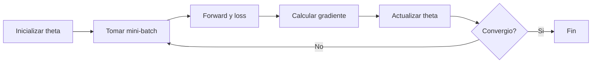

> Gradient descent ajusta los parametros de un modelo para reducir su error.

## Objetivo

Entrenar significa encontrar parametros $$\theta$$ que minimicen la perdida:

$$
\theta^* = \arg\min_{\theta} \mathcal{L}(\theta)
$$

## Regla de actualizacion

$$
\theta_{t+1} = \theta_t - \alpha \nabla_{\theta}\mathcal{L}(\theta_t)
$$

- $$\nabla_{\theta}\mathcal{L}$$: gradiente (direccion de mayor subida).
- Se resta para bajar la perdida.
- $$\alpha$$: learning rate.

```mermaid
flowchart LR
    T0[Parametros actuales theta_t] --> G[Gradiente g = nabla L(theta_t)]
    G --> S[Paso: alpha * g]
    T0 --> U[Actualizar]
    S --> U
    U --> T1[Nuevos parametros theta_t+1]
```

## Tipos

- **Batch GD**: usa todo el dataset por paso.
- **SGD**: usa un solo ejemplo por paso.
- **Mini-batch GD**: usa un bloque pequeno (el mas usado en deep learning).

## Intuicion rapida

- learning rate muy alto: inestable.
- learning rate muy bajo: lento.
- no garantiza minimo global, pero suele encontrar soluciones buenas en alta dimension.

## Pseudocodigo

```text
inicializar theta
repetir:
    tomar mini-batch B
    calcular loss L(theta; B)
    calcular gradiente g
    theta = theta - alpha * g
```



## Ejemplo minimo (NumPy)

```python
import numpy as np

X = np.array([[0.0], [1.0], [2.0], [3.0]])
y = np.array([1.0, 3.0, 5.0, 7.0])  # y = 2x + 1

w, b = 0.0, 0.0
lr = 0.1

for _ in range(500):
    y_hat = w * X[:, 0] + b
    err = y_hat - y
    dw = (2 / len(X)) * np.sum(err * X[:, 0])
    db = (2 / len(X)) * np.sum(err)
    w -= lr * dw
    b -= lr * db

print(w, b)
```

## Resumen

- Gradient descent minimiza la perdida paso a paso.
- Necesita gradientes para funcionar.
- Esos gradientes en redes multicapa se calculan con **backpropagation**.
